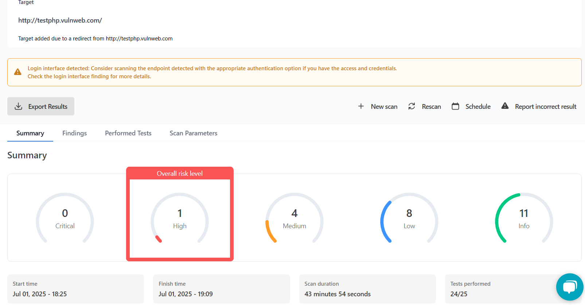

# Penetration Testing Lab: Port & Website Scanning

## Overview
This hands-on penetration testing lab demonstrates two core recon techniques: **TCP port scanning** and **website vulnerability scanning**. These tasks simulate early-stage activities in a penetration test to help identify open ports, running services, and potential web security issues on known, authorized targets.

## Objectives
- Perform a port scan on a safe test target using Pentest-Tools
- Conduct a website vulnerability scan using the same platform
- Interpret scan results and suggest appropriate security mitigations

---

## Tools Used
- [Pentest-Tools.com](https://pentest-tools.com)
- [scanme.nmap.org](https://scanme.nmap.org) — authorized port scanning target
- [testphp.vulnweb.com](http://testphp.vulnweb.com) — intentionally vulnerable web application
- Snipping Tool — for capturing and annotating screenshots

---

## Task 1: Port Scan on scanme.nmap.org

- Performed a **TCP SYN scan** using Pentest-Tools' Port Scanner.
- Target: `scanme.nmap.org` (authorized by the Nmap Security Project).
- Detected two **open ports**:
  - **Port 22 (SSH)** — Running OpenSSH 6.6.1p1 on Ubuntu 14.04
  - **Port 80 (HTTP)** — Running Apache HTTPD 2.4.7

**Scan Parameters**:
- Protocol: TCP
- Scan Type: Light
- OS Detection: Disabled
- Service Version Detection: Enabled
- Ports Scanned: Top 1000
- Scan Technique: TCP SYN

📷 **Screenshot**:  

### Observations & Suggested Mitigations

#### Port 22 (SSH)
- **Risk**: Running an older version of OpenSSH may expose the host to known vulnerabilities or brute-force attacks.
- **Mitigation**:
  - Upgrade to the latest secure version of OpenSSH.
  - Enforce **key-based authentication**, disable password login.
  - Restrict access via **IP allowlists** or firewall rules.
  - Use **Fail2Ban** to block repeated login attempts.

#### Port 80 (HTTP)
- **Risk**: Apache 2.4.7 is outdated and may lack modern security features.
- **Mitigation**:
  - Upgrade Apache to a patched and supported version.
  - Migrate to **HTTPS (port 443)** and force secure connections.
  - Add security headers such as `Content-Security-Policy`, `X-Frame-Options`, etc.

---

## Task 2: Website Vulnerability Scan on testphp.vulnweb.com

- Used the **Website Scanner** on Pentest-Tools to evaluate `testphp.vulnweb.com`.
- This is a deliberately vulnerable site provided for ethical hacking and testing purposes.

### Scan Results Summary
- **1 High-Risk Vulnerability**
- **4 Medium-Risk Vulnerabilities**
- **8 Low-Risk Issues**
- **11 Informational Findings**
- **Scan Duration**: 43 minutes, 54 seconds
- **Tests Performed**: 24/25

📷 **Screenshot**:  

### Notable Issues & Suggested Remediations

#### High-Risk Vulnerability
- **Issue**: Likely related to missing authentication enforcement or input validation.
- **Remediation**:
  - Sanitize and validate all user inputs on both the client and server sides.
  - Apply authentication and session controls to prevent unauthorized access.
  - Use parameterized queries to mitigate injection attacks.

#### Medium-Risk Vulnerabilities
- **Missing HTTP Security Headers**:
  - `Content-Security-Policy`: Mitigates cross-site scripting.
  - `X-Frame-Options`: Prevents clickjacking.
- **Lack of `security.txt` File**:
  - Adds a way for ethical hackers to report vulnerabilities.
- **Remediation**:
  - Configure headers in the web server or application layer.
  - Create a `/.well-known/security.txt` with contact details and disclosure policy.

---

## Key Takeaways
- Practiced legal, ethical reconnaissance and scanning on test systems.
- Analyzed real-world scan outputs to identify vulnerable services and poor configurations.
- Recommended mitigation strategies based on industry best practices.

---

## Files Included
- `port-scan-detailed.png`: Screenshot of port scan on `scanme.nmap.org`
- `website_vulnerability_scan.png`: Screenshot of vulnerability scan on `testphp.vulnweb.com`

