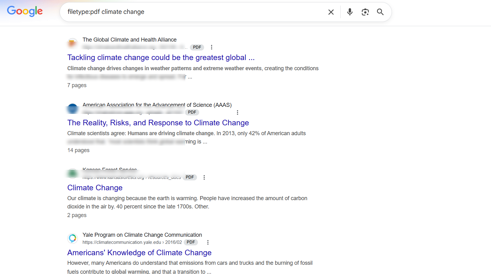

# Google Dorking Lab — IBM Penetration Testing Course

This lab demonstrates my hands-on experience applying **Google Dorking** commands to simulate reconnaissance techniques used in ethical penetration testing. This activity was part of the IBM Cybersecurity Analyst Professional Certificate – Penetration Testing Module.

## Learning Objectives
- Apply Google Dorking commands in pen-testing scenarios
- Gather OSINT (Open Source Intelligence) using search engine queries
- Identify exposed data, outdated content, or sensitive files using public tools
- Analyze how different commands support information gathering

---

## Commands Practiced & Purpose

| Command | Purpose |
|--------|---------|
| `filetype:pdf climate change` | Locate PDF documents that may include internal or sensitive information |
| `intext:machine learning` | Search for webpages discussing specific technologies |
| `web development -JavaScript` | Filter out noisy results by excluding terms |

---

### Locating File Types — `filetype:pdf climate change`

This command identifies publicly accessible PDF documents related to climate change. These documents can potentially expose policy information or outdated data useful during the reconnaissance phase of a penetration test.

---

### In-Text Search — `intext:machine learning`

This Google Dork retrieves webpages that include the term "machine learning" in the body text. This is useful during reconnaissance to identify relevant technical content, implementation details, or public documentation from trusted sources.

---

### Excluding Terms — `web development -JavaScript`

This Google Dork excludes pages containing the term "JavaScript," allowing the user to focus on other aspects of web development. This technique is helpful for OSINT and reconnaissance when narrowing the scope of search results to avoid dominant technologies.

---

## Ethical Use Disclaimer

All Google Dorking commands in this project were used solely for educational purposes. No attempts were made to access private data, exploit vulnerabilities, or target specific systems. All content shown is publicly available from trusted sources.

---

## Course Info

**Course**: IBM Penetration Testing, Threat Hunting, and Cryptography
**Module**: Penetration Testing
**Lab**: Practicing Google Dorking Commands  
**Platform**: Coursera

